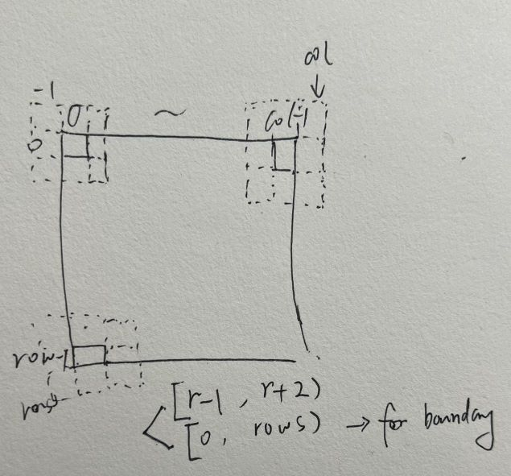

[TOC]
# Game 
* involves a set of cells within an N * N **Grid** -- universe
* Cells' **state**:alive or dead(1 / 0) -- life
* **Rule** of GOL denpends on 8 connected cells(3 * 3):
  1. Underpopulation: A live cell that has **< 2** live neighbouring cells will die 
  2. Survival: A live cell that has **2-3** live neighbouring cells will remain alive 
  3. Overpopulation: A live cell with **more than 3** live neighbours will die 
  4. Reproduction: A dead cell with **exactly 3** live neighbours will become alive 
* **Enviroment**: python, numpy, scipy and matplotlib created by conda

## Game of Life Simulation

**README**: note of this project

**pic**: pictures of the README

**conway.py**: fundamental of grid and logical evovle

**rle**: rle String parser machine

**rle_File**: all rle file and Plaintext referenced

**test_gilder_simple.py**: creat static figure of grid

**test_glider.py**: creat dynamic figure of grid, included 3 different pattern(size >20)

**test_Turing.py**: create daynamic figure of grid in FastMode, including 3 different pattern(size >20) and one large module and Turing module.

**try**: not important file for parttern that can ignored
### conway 
#### Init()
  1. **grid** (N * N), N=256
      ```[[0 0 0 ... 0 0 0]
      [0 0 0 ... 0 0 0]
      [0 0 0 ... 0 0 0]
      ...
      [0 0 0 ... 0 0 0]
      [0 0 0 ... 0 0 0]
      [0 0 0 ... 0 0 0]]
      ```
  2. **neighbor** 8 connected kernel (Convolution kernel卷积核)
      ```
      [1 1 1]
      [1 0 1]
      [1 1 1] 
      ```
  3. **finite** (false by default) Grid was considered as infinite, the part beyond the boundary is regarded as 0 
#### getStates() = getGrid() 
  * return grid
#### evolve()
  * **neighbors_count**  
    1. **NormalMode** ：weight sum Array using Loop to count every pixel
      index: 
    2. **FastMode** :weight sum Array = currentgrid *(convolution) neighborhood
  * **new_grid** judge the new state of every pixels depends on the rule
#### insertBlinker()
  * insert lives at (0,1); (1,1); (2,1) 

    ](pic/blinker.png)
#### insertGlider()
  * insert lives at (0,1); (1,2); (2,0); (2,1); (2,2)
    
    ](pic/glider.png)
#### insertGliderGun()
  * insert lives
    
    ](pic/glidergun.png)

#### insertFromPlainText()
  * insert lives from txtString
  * iterate 

#### insertFromRLE()
  * insert lives from rle file
  * parser the rleString as 2-dimention list
  * iterate the array to populate the game grid 

### test_simple 
  1. grid (64 * 64)
  2. insert live
  3. evolve
  4. update
  5. figure
  6. show static figure of grid

### rle 
#### Run-length encoding 
  * rle (行程编程) ：an encoding thechnique - lossless data compression form (无损数据压缩形式).
  * runs(a sequence of idential data values occurring in consecutive data elements; 连续数据元素中出现相同数据值的序列) stored as a single value and its sequence.
  * e.g
  `WWWWWWWWWWWWBWWWWWWWWWWWWBBBWWWWWWWWWWWWWWWWWWWWWWWWBWWWWWWWWWWWWWW` -> `12W1B12W3B24W1B14W`
  *  Its compact format typically used to describe cellular automata patterns.
       * **number**: sequences of cells
       * **state**: `b`-dead; `o`-live
       * `$`: a new line
       * `!`: the end of data
#### function
  parses the input string and populates(填充) the pattern into a 2-dimensional array format.
#### init()
  * **rle encoded string** : input
  * **attributes**: name, author, dimensions(size_x,size_y), birth, survival rules, raw pattern string(原始模式字符串)
#### populate_attributes()
  * parse line by line. extract metadata(提取元数据), depending on various prefixes.
#### populate_pattern()
  *  Converts the raw RLE string (excluding metadata) into a 2D list representing the cellular automaton grid.
  *  e.g gosperglidergun.rle
    ```['b', 'b', 'b', 'b', 'b', 'b', 'b', 'b', 'b', 'b', 'b', 'b', 'b', 'b', 'b', 'b', 'b', 'b', 'b', 'b', 'b', 'b', 'b', 'b', 'o', 'b', 'b', 'b', 'b', 'b', 'b', 'b', 'b', 'b', 'b', 'b'],
      ['b', 'b', 'b', 'b', 'b', 'b', 'b', 'b', 'b', 'b', 'b', 'b', 'b', 'b', 'b', 'b', 'b', 'b', 'b', 'b', 'b', 'b', 'o', 'b', 'o', 'b', 'b', 'b', 'b', 'b', 'b', 'b', 'b', 'b', 'b', 'b'], 
      ['b', 'b', 'b', 'b', 'b', 'b', 'b', 'b', 'b', 'b', 'b', 'b', 'o', 'o', 'b', 'b', 'b', 'b', 'b', 'b', 'o', 'o', 'b', 'b', 'b', 'b', 'b', 'b', 'b', 'b', 'b', 'b', 'b', 'b', 'o', 'o'],
      ['b', 'b', 'b', 'b', 'b', 'b', 'b', 'b', 'b', 'b', 'b', 'o', 'b', 'b', 'b', 'o', 'b', 'b', 'b', 'b', 'o', 'o', 'b', 'b', 'b', 'b', 'b', 'b', 'b', 'b', 'b', 'b', 'b', 'b', 'o', 'o']
    ```
       
       
      
#### str()
  return the original rle.
#### format()
  * Custom string formatting for debugging or display, which outlines all parsed data in a structured format.
#### human_friendly_pattern()
  * A property that formats the 2D array into a string that visually represents the cellular automaton grid in a more human-readable form. `.` - dead; `o` - live
  * e.g gosperglidergun.rle
      ```
      ........................o...........
    ......................o.o...........
    ............oo......oo............oo
    ...........o...o....oo............oo
    oo........o.....o...oo..............
    oo........o...o.oo....o.o...........
    ..........o.....o.......o...........
    ...........o...o....................
    ............oo......................
      ```
  #### comments()
  * returns formatted comments 
  * using pfomat() for better readability
### relevant function
#### numpy
`numpy.ones(shape,dtype=None,order='C')`
  * shape: N or (N*M)
  * dtype: data type (float64 by default) 
                  
    `dtype = int or [('x,'int'),('y','float')]`
  * oder: {'C', 'F'} memory store method

#### scipy
`signal.convolve2d(in1, in2, mode='full', boundary='fill', fillvalue=0)`
  * **in1** : array_like, First input C
  * **in2** : array_like, Filter kernel. Should have the same number of dimensions as First input.
  * **mode**: convolution mode: str {'full', 'valid', 'same'}, optional
  
    1.`full` The output is the full discrete linear convolution of the inputs. (Default) (完全离散线性卷积)

    2.`valid` The output consists only of those elements that do not rely on the zero-padding. In 'valid' mode, either :None:None:`in1` or in2 must be at least as large as the other in every dimension.

    3.`same` The output is the same size as :None:None:`in1`, centered with respect to the 'full' output.
  * **boundary**: str {'fill', 'wrap', 'symm'}, optional
      A flag indicating how to handle boundaries

      1.`fill` pad input arrays with fillvalue. (default)

      2.`wrap` circular boundary conditions.（圆形边界条件）

      3.`symms` symmetrical boundary conditions. (对称边界条件)
  * **fillvalue**: scalar, optional
      Value to fill pad input arrays with. Default is 0.
  * **same convolution** 
    In signal processing and machine learning, particularly in the context of neural networks, convolution operations are used to apply a filter to an input to produce an output. The term "same" convolution refers to a type of convolution that applies padding to the inputs so that the output has the **same spatial dimensions** as the input.
    The anchor point of the convolution kernel卷积核锚点 
    ](pic/convolution1.jpg)
#### plt
`plt.gca()`


### problems that have met

  * `rle.py` **error**: 
      ``` "e:\me\python\GameA2\env_Game\Lib\pprint.py" is overriding the stdlib module "pprin ```

      **reason**: filename has the same name as a stdlib python module

      **method**: add ` "reportShadowedImports": "none" ` to the ` .vscode/settings.json `

      **reference**:https://stackoverflow.com/questions/74660176/using-visualstudio-python-how-to-handle-overriding-stdlib-module-pylancer

  * `insertFromPlainText` **error**:

      `plaintxt` is different with `rle.human_friendly_pattern` from the express of live `O`;`o`

### Reference rle
  **file from kiwi**: https://conwaylife.com/wiki/30P25#LCM_oscillators


### Part H 
##### Given the Turing machine pattern runs within GoL, comment on whether GoL is Turing complete. 
  (Justify your answer by referencing the theory of Turing machines and the different components 
  of the Turing machine pattern provided using this link: http://rendell-attic.org/gol/tm.htm)
**ans**: it is indeed Turing complete.
*  the definition of Turing machine
https://plato.stanford.edu/entries/turing-machine/#TuriDefi
 A Turing machine, in computational theory, is a mathematical model of computation that defines an abstract machine, which manipulates(操纵) symbols on a strip of tape according to a table of rules. 
* To be considered Turing complete, a system must be able to:
    1. Represent a set of states including an initial state and one or more halt states.
    
    2. Read and write symbols from a defined alphabet.
    
    3.  Have a form of memory (like the tape in a Turing machine). - grid
    
    4.  Have a set of rules or transitions that determine the next state and symbol output based on the current state and symbol.
* The existence of such patterns indicates that any computation that can be performed by a Turing machine can also be performed within GoL, given enough time and space.
* As with all Turing machines the tape can be arbitrarily long. In practice the size can be set by the maximum number of cycles the machine will be run
* weakness：GoL take complex computations due to inefficiencies and the vast amount of space and time

* 
  
1. Memory: represents where the computer stores data. In the Game of Life implementation, this would be represented by specific arrangements of cells to store information, with each configuration representing different data bits.
2. Clock: controls the timing of the system. In computer hardware, a clock generates periodic signals to synchronize operations. In the Game of Life construct, a clock might consist of a series of cells that change regularly (like oscillators), whose changes propagate through the rules of the Game of Life and drive the operations of other parts of the computer.
3. ALU (Arithmetic Logic Unit): handles basic arithmetic and logical operations. An ALU built within the Game of Life would use the rules of the cellular automaton to simulate these operations. For instance, it might use specific cell structures to represent addition, subtraction, or logical operations, and carry out computations through the changing states of cells.
4. Program: the area where instructions are stored, controlling how the computer executes operations. In a Game of Life implementation, a program might be encoded along a string of cells, with the state of each cell (alive or dead) representing a bit of instruction.


Memory（内存）：图中的“Memory”区域代表计算机存储数据的地方。在生命游戏的实现中，这可能通过一系列特定的细胞排列来存储信息，每个排列代表不同的数据位。

Clock（时钟）：生命游戏的“Clock”部分控制整个系统的时间步进。在电脑硬件中，时钟产生周期性的信号来同步操作。在生命游戏的构造中，时钟可能由一系列定期产生变化（如振荡器）的细胞组成，这些变化通过生命游戏的规则传播，并驱动计算机的其他部分运作。

ALU（算术逻辑单元）：ALU是处理基本算术和逻辑运算的计算机部件。在生命游戏中构建的ALU会使用细胞自动机的规则来模拟这些操作。例如，它可能使用特定的细胞结构来表示加法、减法或逻辑操作，并利用细胞的变化来执行运算。

Program（程序）：这是存储指令的区域，它控制计算机如何执行操作。在生命游戏中的实现中，程序可能被编码在一长串细胞中，每个细胞的状态（生存或死亡）代表一个指令位。

print(输出)
